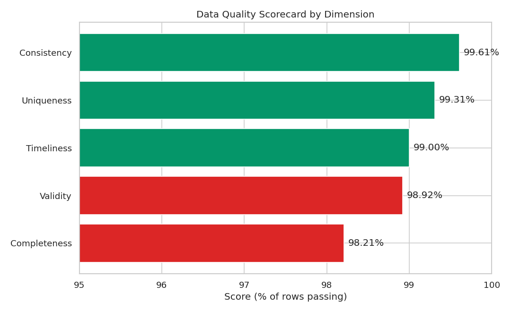
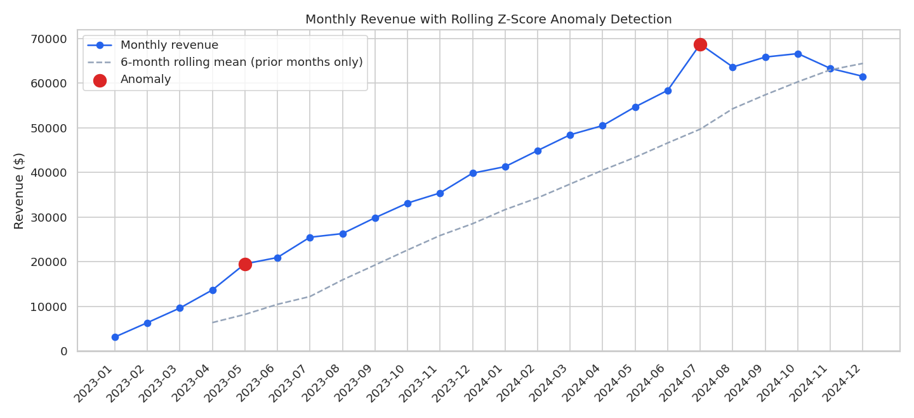

# Revenue Assurance: Data Quality & Anomaly Monitoring System

A SaaS-style subscription billing pipeline (customers → subscriptions → invoices → payments) with two **deliberately separate** monitoring layers:

1. **Rule-based data quality checks** (SQL views) — catch structurally broken data: missing fields, duplicate keys, broken foreign keys, out-of-range values, late invoicing.
2. **Statistical anomaly monitoring** (Python: pandas + scikit-learn) — catch values that are individually well-formed but statistically unusual: a demand-shock month, or a customer billed far outside their own normal pattern. Rule checks structurally can't catch these; only statistics can.

Packaged as an installable Python module with a CLI, type hints, logging, and a pytest suite — not a notebook.

## The problem this models

A DQ rule can tell you a value is `NULL` or negative, but it will never tell you that a *perfectly valid-looking* $2,224.60 invoice on an $8.95 plan is wrong. That takes a statistical baseline. This project builds both layers and keeps them architecturally distinct: `sql/` for what rules can catch, `src/revenue_assurance/anomaly.py` for what only statistics can.

## Results

- **20,547** invoices across 1,500 customers over 24 months, with both defect types injected at controlled rates
- **DQ Scorecard**: 98.2%–99.6% across five dimensions (Completeness, Uniqueness, Validity, Consistency, Timeliness)
- **142** duplicate invoice-number groups (**$11,460.82** at risk of double-billing), **81** orphan invoices (bad customer reference, **$4,019.96** at risk), **206** invoices averaging **83 days** late
- **Z-score monitoring** correctly flagged the injected demand-shock month (July 2024, z ≈ 3.0) — a month where ~15% of invoices were accidentally double-charged
- **Isolation Forest** flagged **167** invoices (**$42,035.13**) billed far outside their plan's expected charge — including several billed 10x+ their plan price




More charts in [`outputs/`](outputs/), including Power BI-ready exports (`dq_scorecard_export.csv`, `anomaly_flags_export.csv`).

## Tech stack

PostgreSQL (schema, DQ rule views) · Python · pandas · scikit-learn (Isolation Forest) · psycopg2 · SQLAlchemy · Matplotlib · Seaborn · pytest

## Project structure

```
revenue-assurance-dq/
├── sql/
│   ├── 01_schema.sql                  # Tables (intentionally loosely constrained — see note below)
│   ├── 02_load_data.sql                # \copy data into Postgres
│   └── 03_data_quality_rules.sql       # One view per DQ dimension + the scorecard rollup
├── src/revenue_assurance/
│   ├── config.py                       # DB params, paths, detection thresholds
│   ├── db.py                            # Connection helpers (psycopg2 + SQLAlchemy)
│   ├── data_generation.py              # generate_dataset(): pure, seeded, reproducible
│   ├── dq_queries.py                    # Thin wrappers over the SQL DQ views
│   ├── anomaly.py                       # rolling_zscore(), iqr_outliers(), isolation_forest_anomalies() — pure, no I/O
│   ├── anomaly_store.py                 # Writes detection results to the anomaly_flags table
│   ├── charts.py                        # One function per chart, given already-computed data
│   ├── summary.py                       # Text report builders — pure formatting
│   └── cli.py                            # `revenue-assurance` entry point (3 subcommands)
├── tests/                                # pytest suite — synthetic fixtures, no DB needed
├── data/                                 # Generated CSVs, loaded via \copy
├── outputs/                              # Charts, reports, Power BI-ready exports
├── pyproject.toml
└── README.md
```

## Running it

Requires PostgreSQL running locally.

```bash
git clone https://github.com/Ahmedang0/revenue-assurance-dq.git
cd revenue-assurance-dq
pip install -e ".[dev]"

# Create the database and build the schema
createdb revenue_assurance_dq
psql -d revenue_assurance_dq -f sql/01_schema.sql
psql -d revenue_assurance_dq -f sql/02_load_data.sql       # loads the CSVs already in data/
psql -d revenue_assurance_dq -f sql/03_data_quality_rules.sql

# Run the DQ scorecard and anomaly monitoring reports
revenue-assurance dq-report
revenue-assurance anomaly-report

# Run the test suite (no database needed — uses synthetic fixtures)
pytest
```

To regenerate the dataset from scratch (same seed, same numbers):
`revenue-assurance generate-data` (writes fresh CSVs to `data/`, then re-run the `\copy` steps above).

## Data & methodology notes

- Data is **synthetic but structurally realistic**: 1,500 customers on 4 plans, 24 months of invoices, generated with a fixed seed via `data_generation.py` for reproducibility (`tests/test_data_generation.py` verifies this directly).
- The `invoices` table is deliberately **not** tightly constrained (no `UNIQUE` on invoice number, no `NOT NULL`/`CHECK` on amount, no enforced foreign keys) — that's realistic for a legacy billing table that predates stricter constraints, and it's exactly what the DQ rule engine exists to catch after the fact.
- **Rule-based vs. statistical is a real methodological split, not just two feature sets.** `dq_queries.get_clean_invoices()` only returns rows that already pass basic DQ checks — anomaly monitoring runs on those, so it finds genuinely new statistical anomalies rather than rediscovering the same defects the rule engine already caught.
- **Rolling z-score correctness detail**: `anomaly.rolling_zscore()` computes each point's baseline from *prior* points only (`.shift(1)` before `.rolling()`), never including the point itself. Including the current point in its own baseline dilutes exactly the anomaly you're trying to detect — a real bug caught during development (the first version missed the injected demand-shock month because of it), now covered by a named regression test: `test_excludes_current_point_from_its_own_baseline`.
- In production, the DQ scorecard and anomaly flags would run on a schedule and get logged over time (the `anomaly_flags` table is already designed for that — `anomaly_store.py` writes to it), so degradation trends become visible rather than a one-off snapshot.

## Testing philosophy

Pure logic (`anomaly.py`, `data_generation.py`, `summary.py`) is unit tested directly with small synthetic inputs — no database required. Anything that's mostly I/O (`dq_queries.py`, `anomaly_store.py`, `charts.py`'s actual pixel output) is kept deliberately thin so there's less of it to get wrong, and is exercised via the CLI against a real database rather than mocked. Run `pytest` to see the 14 unit tests; run `revenue-assurance dq-report` / `anomaly-report` against a live Postgres instance for the integration path.
